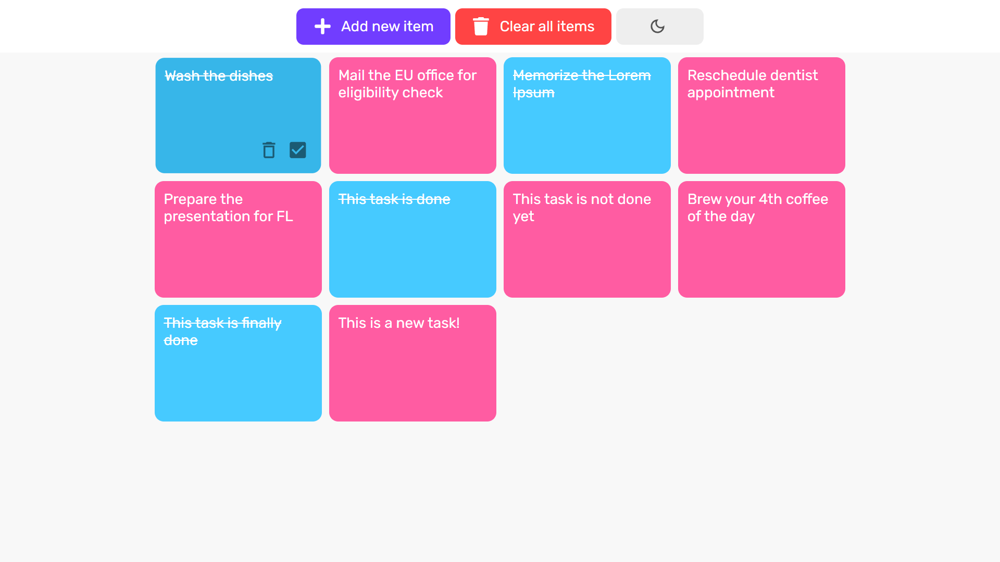
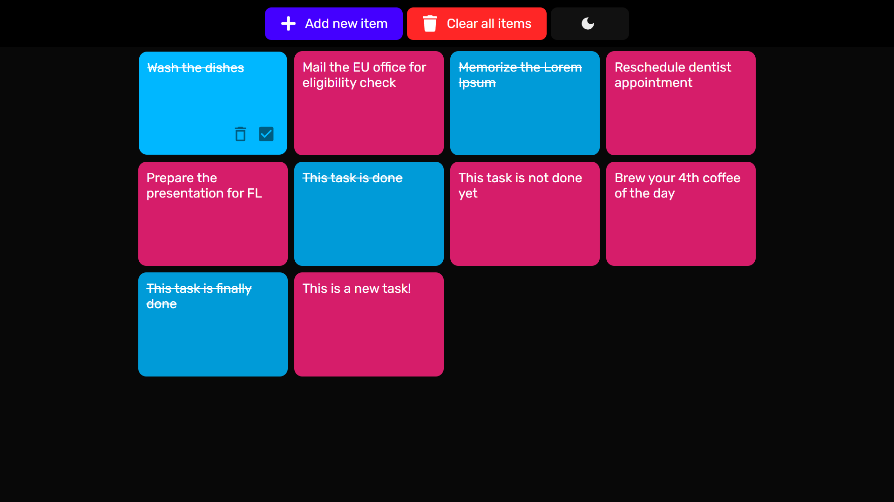
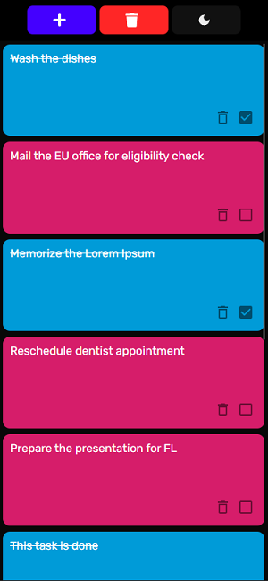
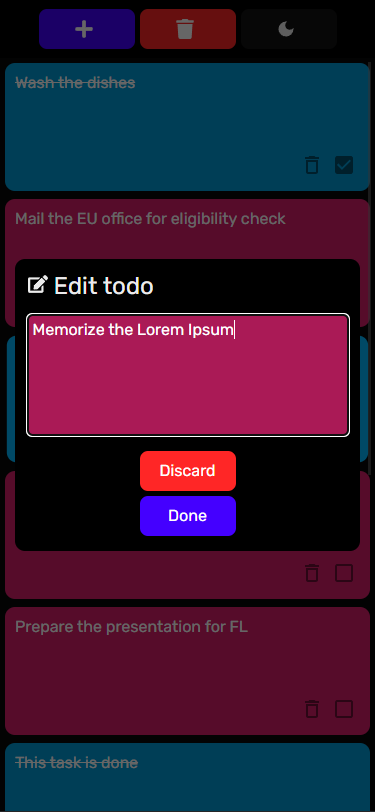
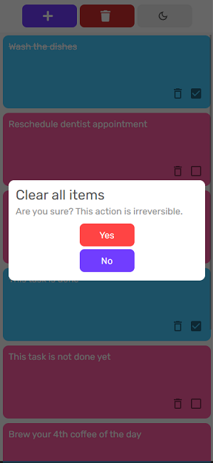
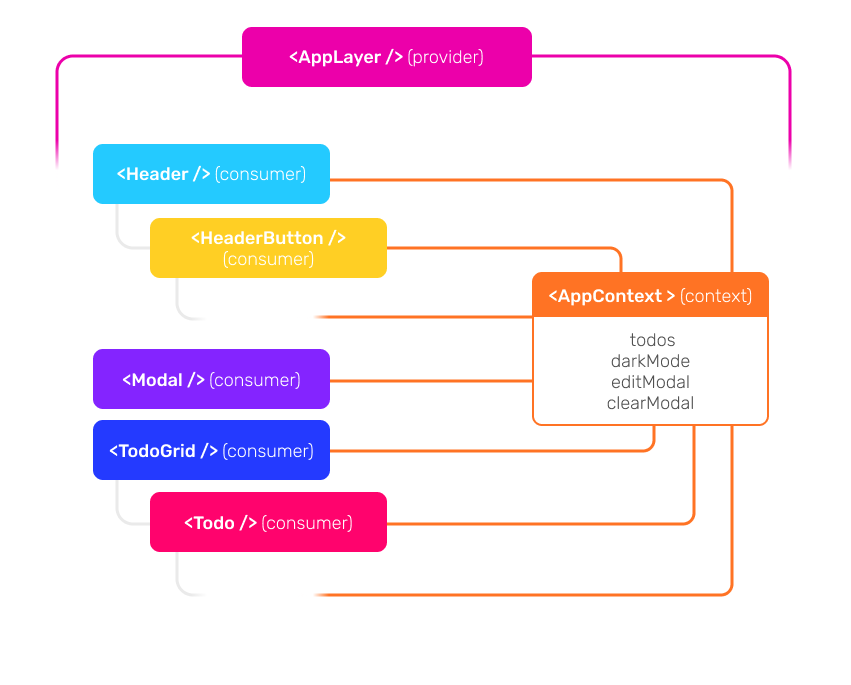

# bashboard

bashboard is a responsive React app for taskkeeping. It lets you list, track and save your tasks. There are no component libraries/frameworks (except for react-icons) and all UI components are written from scratch using JSX and vanilla CSS.

## Screenshots
### Widescreen

[Click here to view the demonstration video above in YouTube.](https://www.youtube.com/watch?v=xw30Z6dmTwE)
### Responsive

## Used dependencies/APIs

- **clsx** is used for conditionally constructing `className` strings for styling elements using the global `App.css`.
- **uuid** is used to generate UUIDs for each task item.
- **react-icons** is used for icons in buttons and modals.
- **Hooks** such as `useState`, `useEffect` in functional components
- **Context** hooks such as `useReducer`, `useContext`, `createContext`
- **Web Storage and JSON API** for saving/reading app state in key, value pairs and parsing/stringifying them

## Architecture

The app employs a Provider/Consumer relationship between other components and the context, which holds todo objects, dark mode and clear/edit modal states, using `useContext`, `createContext` and `useReducer` hooks. The whole app is wrapped within a context provider component `<AppLayer \>` and all of its child components are consumers of it. This way, consumers can access context state without it being percolated down the component tree using props, and they can use this state to dispatch certain actions, with or without payloads, to do certain changes back to it. `reducer` receives these actions and handles the state change accordingly, and centralizes all state-related code in one place. The app state is persistently kept in local browser storage using `localStorage` methods in each `reducer` action.

